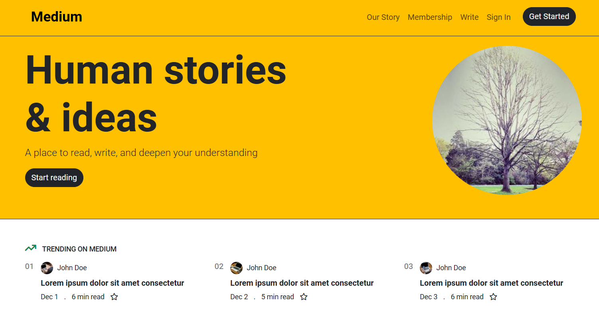

# Medium Homepage Clone

## Description

This repository contains a simple **Medium homepage clone** created with HTML and Bootstrap.

This solution was implemented as part of a project during the **Beginner Frontend Web Development Path**, offered by [Patika.dev](https://www.patika.dev/), where I applied my own unique approaches and methods.

- **Bootstrap Version:** [5.3.3](https://getbootstrap.com/docs/5.3/getting-started/introduction/)
- **Image Source:** [Lorem Picsum](https://picsum.photos/)

---

## Screenshot

The screenshot shows only a portion of the web page.

|             **Medium Homepage Clone**              |
| :------------------------------------------------: |
|  |

---

## License

This repository is licensed under the [MIT License](https://github.com/oktay-acar/medium-clone/blob/main/LICENSE).

---

## Author

[Oktay Acar](https://github.com/oktay-acar)
